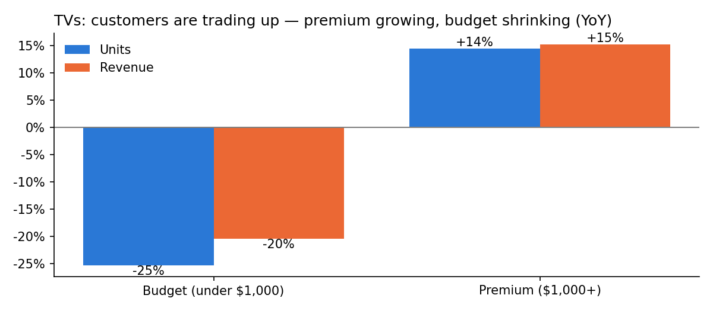
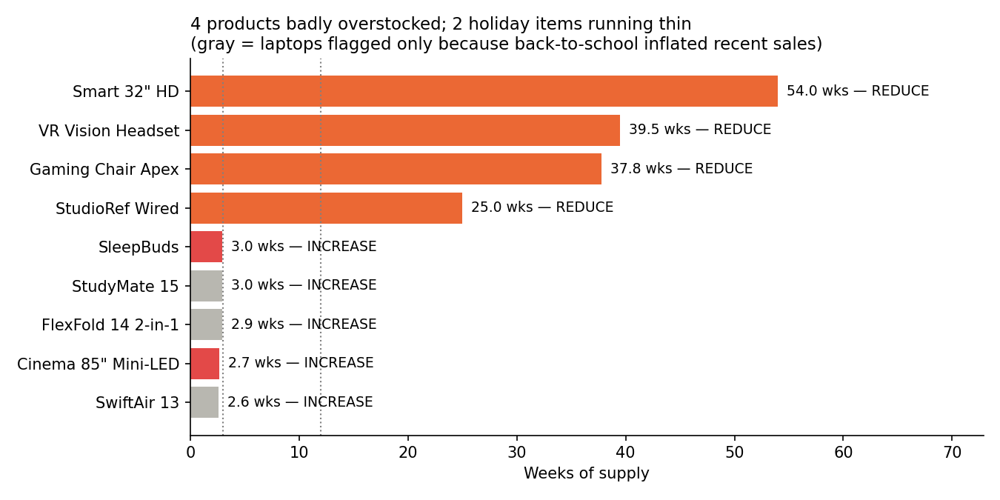

# Retail Demand & Inventory Analytics

**Jaden Boothe** · Python (pandas, matplotlib)

## The question
A consumer-electronics retailer sells 48 products across 6 categories in 4 regions. Going into the holiday season, the planning team needs to know: what's driving sales, where is inventory too high or too low, do promotions work, and what will Q4 demand look like?

## The data
About 30,000 weekly rows (product × region × week, Oct 2023 – Sep 2026): price, discount, units, revenue, inventory on hand, on order, and stockouts.

The dataset was simulated with AI assistance to mimic real retail patterns. All cleaning, analysis and conclusions are my own.

## Cleaning
Ran a standard quality check and fixed 6 issues:
- 40 duplicate rows
- 30 missing brands (filled from each product's other rows)
- 30 missing inventory values (rebuilt with last week + received − sold)
- 15 sign errors in units (confirmed using revenue)
- 8 prices with an extra zero (rebuilt from regular price and discount)
- Inconsistent category labels

After cleaning, units × price = revenue on 100% of rows.

## Key findings
1. **Revenue grew 7.0% but units only 3.5%:** customers are paying more per item.
2. **TVs are trading up:** premium TVs ($1,000+) grew 14% in units while budget TVs fell 25%. TV plans need to be built by model, not by category total.

   

3. **Stockouts jump on Black Friday:** 3% of weeks normally vs. about 11% on Black Friday weeks.
4. **Promotions are often overstated:** Gaming looked like the most promo-responsive category, but that was Black Friday inflating it. Outside the holidays it was the least responsive.
5. **Forecast:** adjusting last year's sales for the current trend cut forecast error from 10% to 8.5%. Q4 2026 outlook: Headphones and Smartphones about +11%, TV units about −9%.

## Recommendations
- **Reduce:** Smart 32" HD, VR Vision Headset, Gaming Chair Apex and StudioRef Wired (25–54 weeks of supply). Cancel open orders and mark down before the holiday.
- **Protect holiday items:** Cinema 85" and SleepBuds are running thin heading into their peak.
- **Don't expedite laptops:** they only look low because back-to-school inflated recent sales.
- **Plan inventory against the forecast, not recent sales.**

## Limitations
- Simulated data.
- No cost or margin data, so promotion results are based on units, not profit.
- The forecast uses sales, which understate demand when products sell out.

## How to run
1. Install: `python3 -m pip install --user pandas numpy matplotlib notebook`
2. Start Jupyter from this folder: `python3 -m notebook`
3. Open `notebooks/my_analysis.ipynb` and run all cells.
