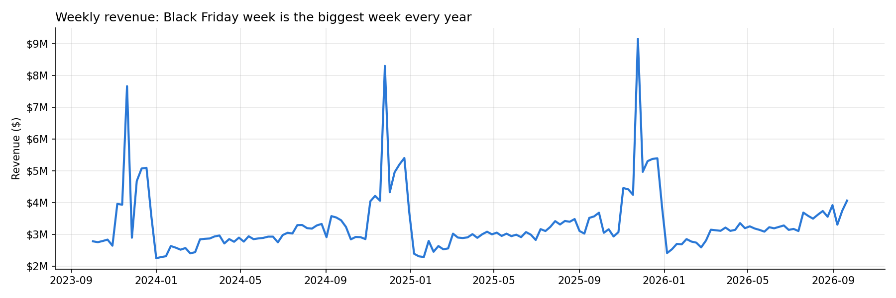

# 🛒 Retail Demand & Inventory Analytics: A Merchandising & Planning Case Study

Analyzing **3 years of weekly sales and inventory** for a consumer-electronics retailer to answer the questions a merchandising and demand planning team asks going into the holidays: what's driving sales, where inventory is too high or too low, whether promotions actually work, and what Q4 demand will look like.

Built with Python, Pandas, and Matplotlib across **~30,000 product × region × week rows** (48 products, 6 categories, 4 regions, Oct 2023 to Sep 2026).

---

## 📊 Results at a Glance

| Metric | Last 52 weeks | vs. prior 52 weeks |
|--------|---------------|--------------------|
| Revenue | **$184.1M** | **+7.0%** |
| Units sold | 345K | +3.5% |
| Average selling price | $533 | +3.4% |

Stockouts happen in **3% of product-region-weeks** overall, but **~11% during Black Friday weeks**, the most valuable weeks of the year.

Revenue grew twice as fast as units, so customers are paying more per item. Digging into *why* led to the project's main finding.



---

## 🧠 Key Finding: Customers Are Trading Up in TVs

At the category level, TVs looked like they were shrinking: **units down 10%**. But TV revenue was **up 8%**. Breaking the category into segments explains it:

| TV segment | Unit growth | Revenue growth |
|------------|-------------|----------------|
| **Premium ($1,000+)**: 55"+ OLED, 75", 85" | **+14%** | **+15%** |
| **Budget (under $1,000)**: 32", 43", 50" | **−25%** | **−19%** |

A planner looking only at the category total would cut TV orders across the board, ending up short on the premium models customers want and still overstocked on budget TVs nobody's buying. **TV plans need to be built by model, with dollars and units planned separately.**


---

## 🧹 Data Cleaning: 6 Issues Found and Fixed

Every dataset gets the same quality scan first: row count vs. expected grain, duplicates, missing values, min/max ranges for impossible values, label consistency, and whether related columns agree.

| Problem | Rows | Fix |
|---------|------|-----|
| Duplicate rows | 40 | Removed; confirmed one row per product-region-week |
| Missing brand | 30 | Filled from each product's other rows |
| Missing inventory | 30 | Rebuilt with *last week + received − sold* |
| Negative units sold | 15 | Revenue was positive, so these were sign errors, not returns. Corrected. |
| Prices ~10× too high | 8 | Extra-zero typos. Rebuilt from regular price × (1 − discount). |
| Inconsistent category label | 25 | Standardized `tvs` → `TVs` |

**Validation:** after cleaning, units × price = revenue on **100% of rows**.

---

## 📦 Inventory: What to Cut and What to Protect

Weeks of supply = units on hand ÷ average weekly sales. Weeks of cover adds stock already on order.

| Action | Products | Why |
|--------|----------|-----|
| **REDUCE** | Smart 32" HD (54 wks), VR Vision Headset (40), Gaming Chair Apex (38), StudioRef Wired (25) | Declining products sitting on 25 to 54 weeks of stock. Cancel open orders and mark down before the holiday. |
| **PROTECT** | Cinema 85" Mini-LED, SleepBuds | Fast-growing holiday items with under 3 weeks of cover heading into their peak. |
| **DON'T EXPEDITE** | SwiftAir 13, FlexFold 14, StudyMate 15 | Flagged as low, but only because back-to-school inflated recent laptop sales. October demand drops. |

The laptop false alarms show the core lesson: **weeks of supply based on past sales looks backward.** Planning inventory should divide by the *forecast*, not recent sales.


---

## 🏷️ Promotions: Correcting for a Confounding Factor

A simple promo-vs-no-promo comparison is misleading because the biggest promotions happen on Black Friday, when demand is already high. Removing November and December gives a fairer read:

| Category | Raw lift | Fair lift (excl. Nov–Dec) |
|----------|----------|---------------------------|
| Laptops | +84% | +62% |
| Smartphones | +58% | +41% |
| TVs | +94% | +35% |
| Headphones | +94% | +34% |
| Appliances | +42% | +31% |
| **Gaming** | **+96% (looked highest)** | **+30% (actually lowest)** |

Gaming looked like the most promo-responsive category, but that was Black Friday inflating it. **Recommendation:** save deep Gaming discounts for Black Friday; use lighter offers or bundles the rest of the year. Laptops' fair lift is likely still inflated by back-to-school, which a regression with week-level controls would separate.

---

## 🔮 Forecasting the 2026 Holiday Quarter

Backtested on the **2025 holiday quarter** (13 weeks, Oct to Dec), using only data available before the forecast start. Accuracy measured with **WAPE** (total absolute error ÷ total actual sales).

| Method | Overall WAPE | TV WAPE |
|--------|--------------|---------|
| Seasonal naive (same week last year) | 10.0% | 14.1% |
| **Trend-adjusted (last year × current 13-week trend)** | **8.5%** | **7.8%** |

The trend adjustment nearly halved TV error but *hurt* Smartphones, because the September phone-launch spike distorted the trend window. **No single method wins everywhere; pick per category based on the backtest.**

**Q4 2026 unit forecast vs. Q4 2025:** Headphones +11%, Smartphones +11%, Gaming +7%, Laptops and Appliances flat, TVs −9% (the decline is all in budget models).

---

## 🎯 Recommendations

1. **Plan TVs by model, not category.** Premium is growing double digits while budget collapses.
2. **Clear the four overstocked products** before holiday floor space gets tight.
3. **Build holiday inventory earlier** for fast-growing items; stockouts more than triple on Black Friday.
4. **Plan against the forecast, not recent sales**, to avoid false alarms like the laptops and catch real holiday risks.
5. **Concentrate deep discounts where they work.** Gaming promos outside Black Friday barely move units.

---

## ⚠️ Limitations

* **Simulated data.** The dataset was generated with AI assistance to mimic real retail patterns (holiday peaks, promotions, supplier shortfalls). All cleaning, analysis, and conclusions are my own.
* **No cost or margin data**, so promotion results are measured in units and revenue, not profit.
* **The forecast is built on sales**, which understate true demand when products sell out.

---

## 🗂️ Repository Structure

```
notebooks/my_analysis.ipynb   # Full step-by-step analysis (start here)
data/retail_weekly_raw.csv    # Raw data, including the planted quality issues
data/retail_weekly_clean.csv  # Cleaned data
images/                       # Charts used in this README
README.md
```

## ⚙️ How to Run

```bash
pip install pandas numpy matplotlib notebook
jupyter notebook notebooks/my_analysis.ipynb
```

---

*Built as a data-analytics portfolio project to practice the core work of merchandising and demand planning: validating the data before trusting it, finding what's driving the numbers, and turning analysis into decisions a planner could act on Monday morning.*
